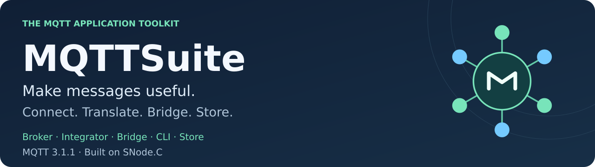
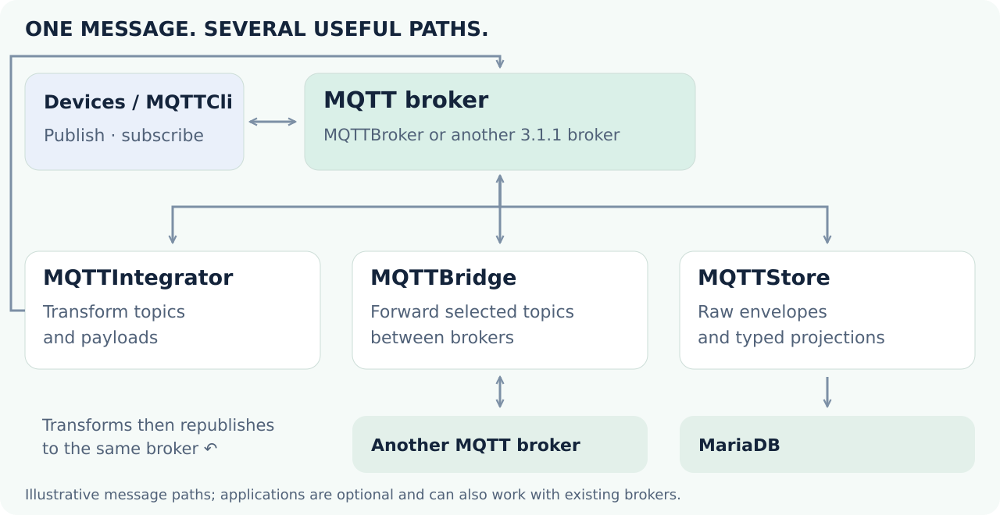

<!-- snodec:begin header -->
<a name="project-overview"></a>

<picture>
  <source media="(max-width: 600px)" srcset="docs/readme/media/hero-mobile.svg">
  
</picture>

# MQTTSuite

<picture>
  <source media="(prefers-color-scheme: dark)" srcset="docs/readme/media/snodec-chip-dark.svg">
  
</picture>
<!-- snodec:end header -->

<!-- snodec:begin status -->
[](https://github.com/SNodeC/mqttsuite/actions/workflows/ci.yml) · [](https://github.com/SNodeC/mqttsuite/releases) · [](https://github.com/SNodeC/Packages#readme) · [](LICENSE)
<!-- snodec:end status -->

**From a device message to an integrated system.**

MQTTSuite is a set of five C++ applications for **MQTT 3.1.1**: run a broker, translate topics and payloads, connect separate brokers, publish and subscribe from the command line, or persist messages in MariaDB. Use the applications independently or combine them into a pipeline that fits your devices and existing services.

Built on [SNode.C](https://github.com/SNodeC/snode.c#project-overview), the suite shares its event-driven networking and configuration model. Native MQTT and MQTT over WebSockets are available over IPv4, IPv6 and Unix-domain sockets, with plain and TLS variants according to build configuration.

<!-- snodec:begin menu -->
<p>
  <a href="#quick-start" title="Start"></a>
  <a href="#install" title="Install"></a>
  <a href="docs/readme/install.md" title="Build"></a>
  <a href="#first-success" title="Use"></a>
  <a href="#configuration" title="Configure"></a>
  <a href="#architecture" title="Architecture"></a>
  <a href="https://snodec.github.io/mqttsuite-doc/html/index.html" title="API"></a>
  <a href="#contributing" title="Contribute"></a>
</p>

<!-- snodec:end menu -->

## Quick start

1. [Install](#install): get the MQTT applications you need.
2. [Use](#first-success): publish and receive your first message.
3. [Configure](#configuration): review runtime settings and access controls before deployment.

## First success

Start with [one publish/subscribe exchange](#publish-your-first-message); then try [mapping](#translate-a-devices-language), [bridging](#bridge-separate-brokers) or [storage](docs/readme/storage.md).

### Publish your first message

Send a message through a broker on your machine; the clients connect through loopback.

**You need:** installed `mqttbroker` and `mqttcli`, three terminals in the same working directory, and free loopback port **18883**. No source checkout is required for these examples.

These experiments assume a first launch without a saved application configuration. Commands show the settings explicitly. MQTTBroker keeps all compiled listeners enabled; the commands below configure the IPv4 MQTT endpoint used by the experiments. Listener addresses retain their defaults, so the broker is not restricted to loopback; the clients below connect through `127.0.0.1`.

**Run — terminal 1, start the broker:**

```text
mqttbroker \
    in-mqtt \
        local --port 18883
```

**Run — terminal 2, subscribe:**

```text
mqttcli \
    in-mqtt --disabled=false \
        remote --host 127.0.0.1 --port 18883 \
        sub --topic 'demo/#'
```

**Run — terminal 3, publish:**

```text
mqttcli \
    in-mqtt --disabled=false \
        remote --host 127.0.0.1 --port 18883 \
        pub --topic 'demo/hello' --message 'Hello from MQTTSuite!' \
        socket --reconnect=false
```

**Expected result:** the subscriber reports topic `demo/hello` and payload `Hello from MQTTSuite!`. Stop the subscriber and broker with Ctrl+C before starting the next example.

**Boundaries:** clients use unencrypted loopback MQTT, with no credentials or persistent sessions. Other compiled broker listeners remain enabled on their default addresses; use an isolated, trusted network until you deliberately bind or disable them. `socket --reconnect=false` makes the publisher a one-shot operation. The configuration section `in-mqtt` names an SNode.C connection instance; its `remote`, `pub`, `sub` and `socket` sections configure that instance's responsibilities.

[](docs/readme/deployment.md)

**Keep a working configuration:** append `-w` (short for `--write-config`) to a working command to save its persistent settings in the application's default INI-style configuration file and exit. Then run the same application without arguments, as the same user, to start with those saved settings. Nonpersistent options are not saved. Configuration uses dotted keys such as `in-mqtt.remote.host="127.0.0.1"`. Save settings after experimenting; later examples assume no saved configuration. See [configuration and deployment](docs/readme/deployment.md#configuration).

### Translate a device’s language

Not every device publishes the topic or payload your application expects. This mapping turns button events into light commands inside MQTTBroker.

**You need:** `mqttbroker` and `mqttcli`. Stop any previous broker on 18883.

**Configuration — save as `mapping.json`:**

```json
{
  "mapping": {
    "topic_level": {
      "name": "devices",
      "topic_level": {
        "name": "button",
        "subscription": {
          "qos": 0,
          "static": {
            "mapped_topic": "actuators/light/set",
            "message_mapping": [
              { "message": "pressed", "mapped_message": "on" },
              { "message": "released", "mapped_message": "off" }
            ]
          }
        }
      }
    }
  }
}
```

**Run — terminal 1:**

```text
mqttbroker \
    in-mqtt \
        local --port 18883 \
    broker --mqtt-mapping-file mapping.json
```

**Run — terminal 2, subscribe before publishing:**

```text
mqttcli \
    in-mqtt --disabled=false \
        remote --host 127.0.0.1 --port 18883 \
        sub --topic 'actuators/light/set'
```

**Run — terminal 3, publish:**

```text
mqttcli \
    in-mqtt --disabled=false \
        remote --host 127.0.0.1 --port 18883 \
        pub --topic 'devices/button' --message 'pressed' \
        socket --reconnect=false
```

**Expected result:**

| Input on `devices/button` | Output on `actuators/light/set` |
| --- | --- |
| `pressed` | `on` |
| `released` | `off` |

**Boundaries:** other payloads do not match these rules. Stop the processes before the next example. To map through an existing broker use MQTTIntegrator instead, with its administrative listeners explicitly disabled as shown in the guide; do not apply the same rules in both places unless duplicate outputs are intended.

[](docs/readme/mapping.md)

### Bridge separate brokers

Forward selected topics between two independent brokers without changing their publishers.

**You need:** `mqttbroker`, `mqttbridge`, `mqttcli`, and free loopback ports **18883** and **18884**. Stop earlier demo brokers.

**Configuration — save as `bridge.json`:**

<details>
<summary>Complete two-broker topology</summary>

```json
{
  "bridges": [{
    "name": "demo",
    "prefix": "relay/",
    "brokers": [
      {
        "prefix": "a/",
        "network": {
          "instance_name": "demo-a",
          "protocol": "in",
          "in": { "host": "127.0.0.1", "port": 18883 },
          "encryption": "legacy",
          "transport": "stream"
        },
        "mqtt": {
          "client_id": "readme-bridge-a",
          "clean_session": true,
          "loop_prevention": true
        },
        "topics": [{ "topic": "telemetry/#", "qos": 0 }]
      },
      {
        "prefix": "b/",
        "network": {
          "instance_name": "demo-b",
          "protocol": "in",
          "in": { "host": "127.0.0.1", "port": 18884 },
          "encryption": "legacy",
          "transport": "stream"
        },
        "mqtt": {
          "client_id": "readme-bridge-b",
          "clean_session": true,
          "loop_prevention": true
        },
        "topics": [{ "topic": "commands/#", "qos": 0 }]
      }
    ]
  }]
}
```

</details>

**Run — terminals 1 and 2, one broker in each:**

```text
mqttbroker \
    in-mqtt \
        local --port 18883
```

```text
mqttbroker \
    in-mqtt \
        local --port 18884 \
    in-mqtts \
        local --port 18885 \
    in6-mqtt \
        local --port 18886 \
    in6-mqtts \
        local --port 18887 \
    in-http \
        local --port 18081 \
    in-https \
        local --port 18082 \
    in6-http \
        local --port 18083 \
    in6-https \
        local --port 18084 \
    un-mqtt \
        local --sun-path /tmp/readme-broker-b-un-mqtt \
    un-mqtts \
        local --sun-path /tmp/readme-broker-b-un-mqtts \
    un-http \
        local --sun-path /tmp/readme-broker-b-un-http \
    un-https \
        local --sun-path /tmp/readme-broker-b-un-https
```

The second broker assigns separate ports and Unix socket paths to its other listeners to avoid conflicts. Omit instance sections absent from your build; see `mqttbroker --help`.

**Run — terminal 3, bridge:**

```text
mqttbridge \
    bridge --definition bridge.json \
    admin-legacy --disabled \
    admin-tls --disabled
```

**Run — terminal 4, subscribe on broker B:**

```text
mqttcli \
    in-mqtt --disabled=false \
        remote --host 127.0.0.1 --port 18884 \
        sub --topic 'relay/#'
```

**Run — terminal 5, publish on broker A after the bridge and subscriber connect:**

```text
mqttcli \
    in-mqtt --disabled=false \
        remote --host 127.0.0.1 --port 18883 \
        pub --topic 'telemetry/temperature' --message '21.5' \
        socket --reconnect=false
```

**Expected result:** broker B's subscriber receives `relay/a/b/telemetry/temperature` with payload `21.5`. The rule is **bridge prefix + source prefix + destination prefix + original topic**.

<picture>
  <source media="(max-width: 600px)" srcset="docs/readme/media/bridge-topics-mobile.svg">
  
</picture>

**Boundaries:** `legacy` means unencrypted transport. `loop_prevention` requests suppression of the bridge's own publications through a non-standard MQTT CONNECT bridge bit also used by Mosquitto; the remote broker must support that bit. For other brokers, disable it and design non-overlapping topic paths. This example's `relay/` outputs match neither `telemetry/#` nor `commands/#`, so they are not fed back into the bridge. MQTTBridge may normalize and rewrite `bridge.json`; use this writable demo copy, not a read-only source of record. Stop all demo processes with Ctrl+C.

[](docs/readme/bridging.md)

### Keep the original message—and query the useful fields

MQTTStore keeps the raw MQTT envelope and projects JSON fields into application-owned typed tables. The [complete storage walkthrough](docs/readme/storage.md) covers MariaDB provisioning, `projections.json`, run commands, expected rows and delivery boundaries. It needs a local MariaDB server; start there after the basic publish/subscribe exchange.

## Capabilities

### Choose the job, choose the application

- **MQTTBroker** (`mqttbroker`) — Connect MQTT publishers and subscribers, inspect clients in the Web UI, and optionally run mappings inside the broker.
- **MQTTIntegrator** (`mqttintegrator`) — Subscribe to an existing broker, transform topics or payloads with static rules and INJA templates, and publish the result.
- **MQTTBridge** (`mqttbridge`) — Connect outward to multiple brokers and relay selected topics between them, with configured prefixes and loop prevention.
- **MQTTCli** (`mqttcli`) — Publish, subscribe and diagnose connections from a terminal or script.
- **MQTTStore** (`mqttstore`) — Store raw MQTT messages in MariaDB and optionally project JSON fields into application-owned typed tables.

MQTTIntegrator, MQTTBridge and MQTTStore connect as MQTT clients; they do not require MQTTBroker as the other endpoint. MQTTBridge is not another broker listener. Its optional `loop_prevention` setting uses a non-standard bridge flag that must be supported by the remote broker; the example below explains the distinction.

### Connect it your way

| Transport | Plain | TLS |
| --- | --- | --- |
| IPv4 | `in-mqtt` | `in-mqtts` |
| IPv6 | `in6-mqtt` | `in6-mqtts` |
| Unix socket | `un-mqtt` | `un-mqtts` |
| WS broker | `in-http` | `in-https` |
| WS client | `in-wsmqtt` | `in-wsmqtts` |

IPv4, IPv6 and Unix socket rows use MQTT directly; their instance names apply to both broker and clients. WS means MQTT over WebSocket; those rows show IPv4 instances.

WebSocket client/server variants also exist for IPv6 and Unix sockets. MQTTBridge creates its connection instances from its topology instead of using this fixed name list. Build-time selections may omit transports. WebSocket peers must agree on the `mqtt` subprotocol; certificates and trust are required for TLS/WSS.

## Architecture

<picture>
  <source media="(max-width: 600px)" srcset="docs/readme/media/message-flow-mobile.svg">
  
</picture>

*Choose the branches you need. These are cooperating applications, not five mandatory stages in one pipeline.*

## Configuration

Use the [runtime configuration guide](docs/readme/deployment.md#configuration) to inspect application settings, persist configuration and choose deployment access boundaries. These are runtime settings; [Build from source](docs/readme/install.md) covers compilation and CMake options.

### Before exposing a service

- **MQTTBroker:** `in-http` / `in-https` combine MQTT-over-WebSocket and the client-inspection UI. They are not separate public/private listeners.
- **MQTTBridge:** `admin-legacy` (8081) and `admin-tls` (8082) expose mutable bridge configuration without built-in authentication. Disable them when unused; isolate or authenticate access outside the application when enabled.
- **MQTTIntegrator:** its mapping-admin HTTP API uses built-in Basic-auth credentials `admin` / `admin` and can rewrite the mapping file. Disable `in-http` and `in-https` unless that API is deliberately isolated behind access controls.

Review the [deployment guide](docs/readme/deployment.md) before exposing a service.

## Documentation

[Documentation index](docs/index.md) — the existing guides and MQTTStore reference.

- **Translate messages:** [Mapping walkthrough](docs/readme/mapping.md)
- **Link brokers:** [Bridge walkthrough](docs/readme/bridging.md)
- **Store telemetry:** [Storage walkthrough](docs/readme/storage.md) and [MQTTStore reference](docs/mqttstore-user-guide.md)
- **Choose packages:** [Binary packages](https://github.com/SNodeC/Packages#readme)
- **Run a service:** [Deployment guide](docs/readme/deployment.md)
- **Extend applications:** [API reference](https://snodec.github.io/mqttsuite-doc/html/index.html) and [SNode.C](https://github.com/SNodeC/snode.c#project-overview)

## Platforms and packages

Native Linux source builds need a C++20 toolchain (GCC 12.2+ or Clang 13+), CMake 3.18+ and SNode.C 2.0.0 or newer compatible components. Signed packages cover Debian, Ubuntu, Rocky Linux, Fedora, Raspberry Pi OS and OpenWrt; check [Packages](https://github.com/SNodeC/Packages#readme) for the current release/architecture matrix.

### Install

Choose your route.

<p>
  <a href="https://github.com/SNodeC/Packages#readme" title="Signed packages"></a>
  <a href="docs/readme/install.md" title="Build from source"></a>
</p>

Choose signed packages for your distribution, release and architecture, or build from source for native Linux or OpenWrt. Application packages install the required SNode.C components automatically; no separate framework build is needed.

## Releases

[Release history and release notes](https://github.com/SNodeC/mqttsuite/releases). SNode.C and MQTTSuite have independent release histories. This source tree requires SNode.C 2.0.0 or newer compatible components; keep application libraries and transport plugins ABI-compatible. See [upgrade checks](docs/readme/deployment.md#before-an-upgrade).

## Contributing

[Report an issue](https://github.com/SNodeC/mqttsuite/issues) with the application, transport, version and a sanitized configuration. Small topic/payload examples make mapping and forwarding reports much easier to reproduce.

<!-- snodec:begin ecosystem -->
## Ecosystem

[SNode.C organization](https://github.com/SNodeC) · Built on [SNode.C](https://github.com/SNodeC/snode.c#project-overview) · [Signed packages](https://github.com/SNodeC/Packages#readme)
<!-- snodec:end ecosystem -->

<!-- snodec:begin footer -->
Copyright © Volker Christian and contributors. MQTTSuite is dual-licensed under **[MIT](LICENSE-MIT) OR [GPL-3.0-or-later](LICENSE-GPL-3.0-or-later)**. SNode.C and bundled dependencies retain their own licensing terms.

Maintainer: [Volker Christian](https://github.com/VolkerChristian). [Organization](https://github.com/SNodeC) · [Contributing](#contributing) · [Security](https://github.com/SNodeC/.github/blob/main/SECURITY.md)
<!-- snodec:end footer -->
