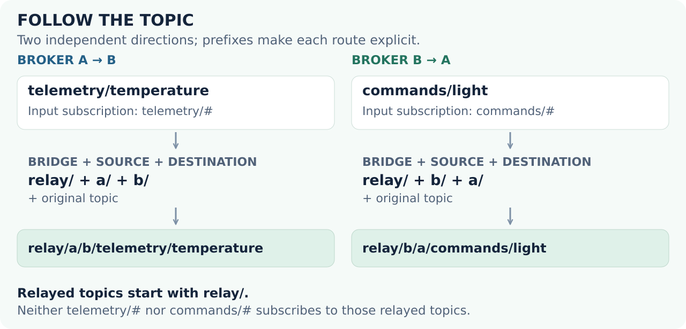

# Connect two brokers

[← MQTTSuite](../../README.md)

MQTTBridge connects as a client to every broker in a logical bridge. Messages received from one connection are forwarded to the other connected brokers, not directly back to their origin. Subscription filters decide which messages enter the bridge; prefixes decide their destination topics.

## The local example

The complete [bridge.json](examples/bridge.json) declares two loopback endpoints:

| Endpoint | Address | Input subscription | Prefix |
| --- | --- | --- | --- |
| Broker A | `127.0.0.1:18883` | `telemetry/#` | `a/` |
| Broker B | `127.0.0.1:18884` | `commands/#` | `b/` |

The bridge prefix is `relay/`. Both connections request clean sessions and set `loop_prevention`. That option uses the non-standard MQTT CONNECT bridge bit also used by Mosquitto to request suppression of a bridge's own publications. Verify support in the remote broker before enabling it; otherwise disable the option and keep the topic paths non-overlapping.

```json
{
  "bridges": [{
    "name": "demo",
    "prefix": "relay/",
    "brokers": [
      {
        "prefix": "a/",
        "network": {
          "instance_name": "demo-a",
          "protocol": "in",
          "in": { "host": "127.0.0.1", "port": 18883 },
          "encryption": "legacy",
          "transport": "stream"
        },
        "mqtt": {
          "client_id": "readme-bridge-a",
          "clean_session": true,
          "loop_prevention": true
        },
        "topics": [{ "topic": "telemetry/#", "qos": 0 }]
      },
      {
        "prefix": "b/",
        "network": {
          "instance_name": "demo-b",
          "protocol": "in",
          "in": { "host": "127.0.0.1", "port": 18884 },
          "encryption": "legacy",
          "transport": "stream"
        },
        "mqtt": {
          "client_id": "readme-bridge-b",
          "clean_session": true,
          "loop_prevention": true
        },
        "topics": [{ "topic": "commands/#", "qos": 0 }]
      }
    ]
  }]
}
```

This is the complete topology, identical to the supplied JSON file. `legacy` means unencrypted transport.

## 1. Start two independent brokers

Run these in separate terminals, from the repository root. Stop an earlier broker on 18883 first.

```sh
mqttbroker --config-file docs/readme/examples/broker.conf
```

```sh
mqttbroker --config-file docs/readme/examples/broker.conf \
  in-mqtt local --port 18884
```

They share the sample’s listener configuration, not broker state; neither command configures a session-store file.

## 2. Start MQTTBridge

```sh
cp docs/readme/examples/bridge.json bridge-demo.json
mqttbridge --config-file /dev/null \
  bridge --definition bridge-demo.json \
  admin-legacy --disabled=true admin-tls --disabled=true
```

MQTTBridge can normalize and write its active definition back to the supplied file; the copy keeps the repository example unchanged. The demonstration disables the bridge’s administrative HTTP listeners. Use distinct client IDs, as the sample does. An existing client with the same ID on a broker can be disconnected by a new connection.

## 3. Observe broker B, then publish on A

```sh
mqttcli --config-file /dev/null \
  in-mqtt --disabled=false \
  remote --host 127.0.0.1 --port 18884 \
  sub --topic 'relay/#'
```

```sh
mqttcli --config-file /dev/null \
  in-mqtt --disabled=false \
  remote --host 127.0.0.1 --port 18883 \
  pub --topic 'telemetry/temperature' --message '21.5' \
  socket --reconnect=false
```

Expected on broker B: `relay/a/b/telemetry/temperature` with payload `21.5`.

The topic is formed as **bridge prefix + origin broker prefix + destination broker prefix + original topic**. In the reverse direction, `commands/light` published on B becomes `relay/b/a/commands/light` on A.

<picture>
  <source media="(max-width: 600px)" srcset="media/bridge-topics-mobile.svg">
  
</picture>

## Deploy a deliberate topology

The sample’s `relay/…` outputs do not match either input subscription. Keep that separation, or design a similarly explicit namespace, when adding brokers. Built-in loop prevention is not a license to connect arbitrary overlapping bridges and wildcard subscriptions without analyzing message paths.

For off-host endpoints, configure TLS and appropriate broker access policy. A bridge is not broker clustering, consensus or an exactly-once end-to-end transaction mechanism. Plan reconnect behavior, retained messages, subscription QoS and persistent sessions around your workload.

Stop all demonstration processes with Ctrl+C. Use the [bridge schema](https://github.com/SNodeC/mqttsuite/blob/master/mqttbridge/lib/bridge-schema.json) for additional network and MQTT options, and the [deployment guide](deployment.md) for unattended operation.
